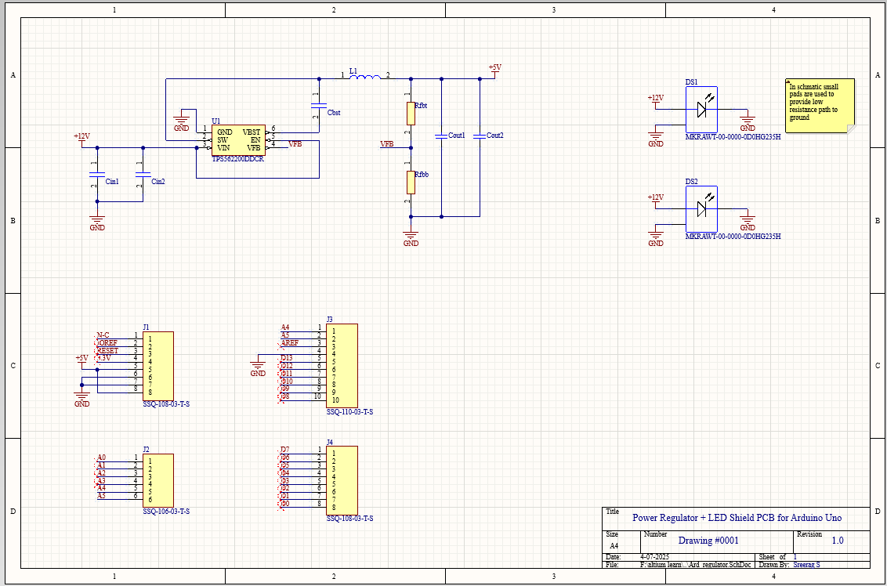
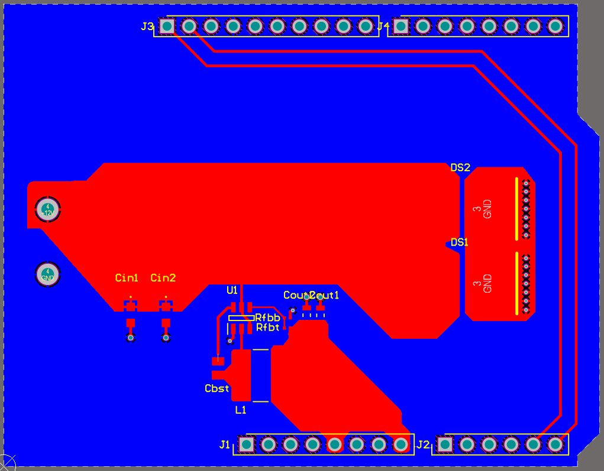
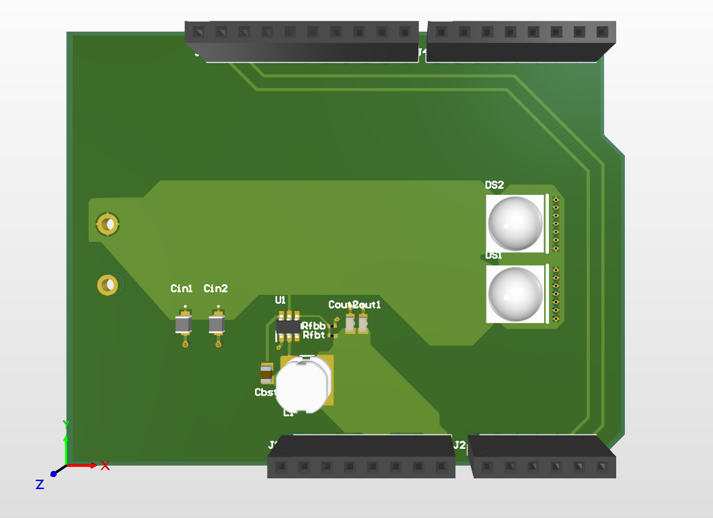

# 🔌 Arduino Power + LED Shield

A custom Arduino Uno shield that:
- Converts 12V input to 5V using a TPS56200 buck converter
- Powers 12V LEDs directly from the board
- Breaks out standard Arduino headers for expansion

---

## 💡 Features

- **Input Voltage:** 12V DC
- **Regulated Output:** 5V (for Arduino Uno)
- **Power IC:** TPS56200DDCR buck converter
- **LEDs:** 2x 12V indicator LEDs
- **Form Factor:** Stackable Arduino Uno shield

---

## 🧰 Files Included

- `AltiumProject/` – Schematic and PCB layout (Altium Designer project)
- `OutputFiles/` – Gerbers, drill files, and BOM for fabrication
- `PDF/` – Printable schematic and board layout PDFs
- `Image/` – Schematic, layout, and 3D view images

---

## 🖼️ Previews

### 🔧 Schematic

### 📐 PCB Layout

### 🧱 3D View

---

## ⚙️ How to Use

1. Connect a +12V DC input to the shield
2. Attach the shield to an Arduino Uno
3. The onboard regulator powers the Arduino with 5V
4. 12V LEDs light up to indicate power or signal status

---

## 📘 License

Open-source hardware project — feel free to modify, remix, or build upon it. Attribution appreciated!

---

## 🙋‍♂️ Contributing

Found a bug or want to suggest an enhancement? Open an issue or pull request. Contributions are welcome!

---
